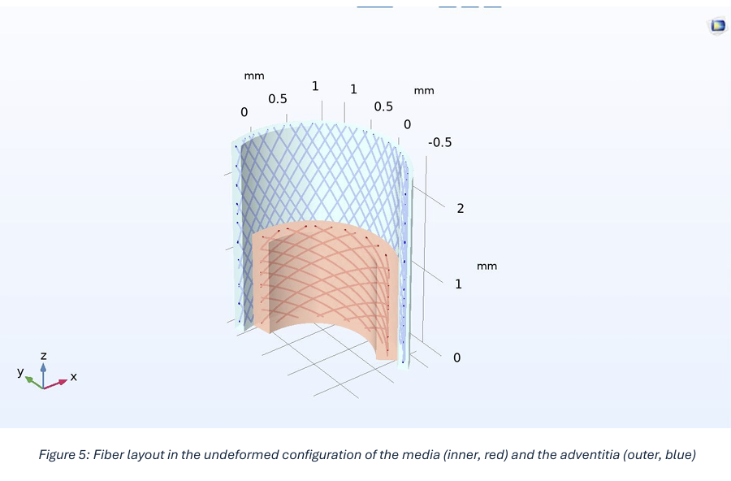
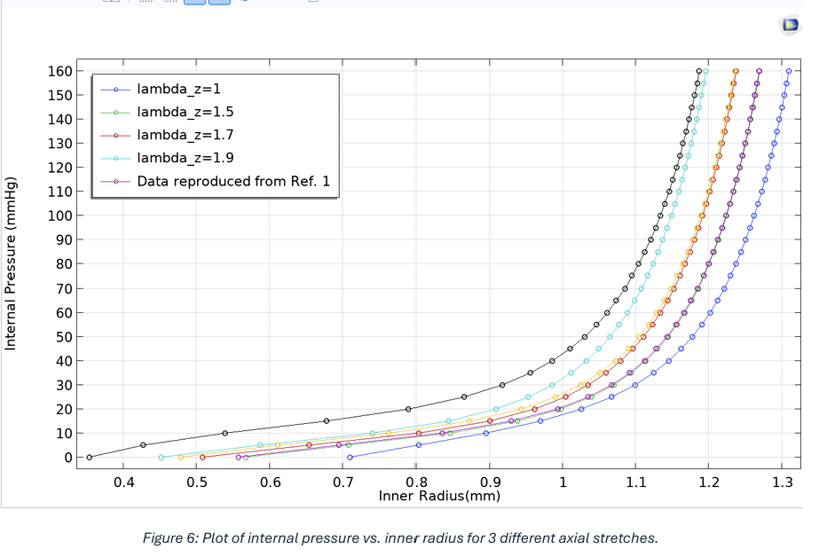
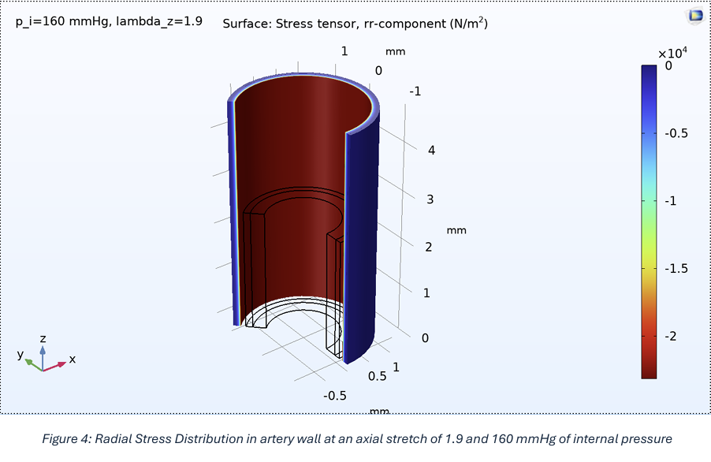

# Arterial Wall Mechanics: HGO Constitutive Modeling & FEA in COMSOL

## 📌 Executive Summary
This repository contains a full non-linear finite element analysis (FEA) framework simulating the anisotropic, hyperelastic mechanics of healthy arterial walls. Utilizing the **Holzapfel-Gasser-Ogden (HGO) strain energy function**, this project models the vascular wall as a thick-walled, two-layered composite tube comprising a non-collagenous elastin matrix reinforced by symmetric families of helical collagen fibers. The simulation successfully maps stress-strain behavior under complex physiological loads.

---

## 🛠️ Technical Specifications & Methods
* **Simulation Engine:** COMSOL Multiphysics.
* **Material Framework:** Hyperelastic Finite Strain Theory.
  * *Isotropic Component:* Neo-Hookean model mapping elastin matrix behavior.
  * *Anisotropic Component:* Exponential strain energy equations tracking collagen fiber activation under tension.
* **Boundary Conditions:** Variable internal blood pressures ($100\text{ mmHg} - 160\text{ mmHg}$) combined with explicit axial stretch parameters ($\lambda_z = 1.7 - 1.9$).

---

## 📊 Structural Geometry & Helical Fiber Architecture
The model replicates two primary structural tissue boundaries: the **Media** layer and the **Adventitia** layer. Each layer is configured with unique, symmetric collagen fiber orientation vectors to accurately capture real biological anisotropy.

  

---

## 📈 Key Findings & Validation Data

### 1. Progressive Strain Hardening
By plotting internal pressure against the changing inner radius of the vascular geometry, the model validates that higher axial stretches ($\lambda_z$) exponentially stiffen the artery. This closely tracks established experimental benchmarking data.

  

### 2. Cauchy & Radial Stress Distributions
Stress concentrations ($\sigma_{\theta\theta}$, $\sigma_{zz}$) peak at the innermost radius and gradually decrease across the wall thickness toward the outer stress-free boundary. This verifies the mechanical load-sharing properties of multi-layered tissue.

  

---

## 📂 Complete Project Documentation
The full 23-page literature review, continuum mechanics math, equilibrium derivations, and step-by-step COMSOL configurations are fully documented in the final project report:

📄 **[Read the Full Technical Report (PDF)](documents/Arterial_Wall_Mechanics_Paper.pdf)**
